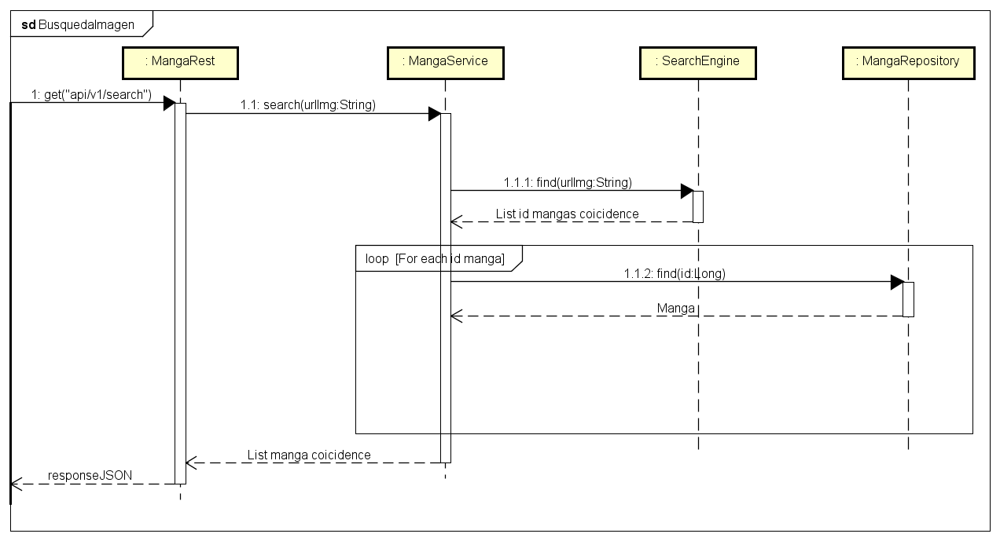

# Documento de arquitectura de software

Proyecto basado en la búsqueda de mangas y comics dentro de un repositorio en la nube.

## Nombre del software

MANICS-REST-API V1.0.0

## Autores

- Emmanuel Isaí Chablé Collí
- Ricardo Nicolás Canul Ibarra
- Iowa Alejandro Olivera Pérez
---
# Introducción

## Propósito

Ante la problemática de que muchas personas no pueden conseguir un comic o manga de manera física por distintos motivos (poder adquisitivo, inexistencias de puntos de venta, pérdida de tiempo en la compra, etc), Se propone en este documento una posible solución de la cuál se proporcionará información relevante al funcionamiento y estructura, como son: La arquitectura del sistema, el acceso a la información, la estructura de la base de datos y otros puntos importantes a destacar.

## Alcance

Lo que se propone es que los usuarios desde una conexión a internet puedan acceder a un amplio catálogo de comics y mangas, siendo capaces de localizar alguno de sus productos favoritos, mediante la búsqueda de texto o imagen.
Se busca que cualquier fanático de comics/mangas pueda registrarse y tener a su disposición un amplio catálogo de estos artículos. De igual manera darle a ciertos usuarios de confianza privilegios para que puedan actualizar y subir nuevo contenido mangas/comics.

## Documentos de referencia

1. http://www.idglat.com/afiliacion/whitepapers/453167_API%20Strategy%20and%20Architecture%20A%20Coordinated%20Approach-LAS.pdf?tk=/

2. https://juanda.gitbooks.io/webapps/content/api/arquitectura-api-rest.html

3. https://iso25000.com/index.php/normas-iso-25000/iso-25010


# Arquitectura

## Descripción de la arquitectura utilizada (Capas)

Para realizar este proyecto, se decidió utilizar una arquitectura por capas de forma que sea posible configurar cada capa de manera independiente sin que el funcionamiento de una tenga consecuencias en otra facilitando así la conexión entre ellas. Las capas en la que se dividirá el proyecto son las siguientes:

1. **Capa de seguridad**: Debido a que nuestra API contará con información sensible de los usuarios registrados será necesario contar con una capa de seguridad sólida en la cual se detendrán las posibles peticiones malintencionadas o sin autorización.

2. **Capa REST**: Manejar todas las peticiones HTTP que se efectúen hacia nuestra RESTFul API.

3. **Capa de negocio**: Contendrá toda la lógica del negocio (Casos de uso, entidades, etc...).

4. **Capa de persistencia de datos**: Encargada de obtener y almacenar datos en la base de datos de acuerdo a las solicitudes que le lleguen desde las reglas del negocio.

5. **Capa de almacenamiento en caché**: Con el fin de mantener una sensación de fluidez en la plataforma, será necesario contar con una capa de caché que sea capaz de almacenar y devolver los resultados de algunas de las peticiones más comunes con el fin de reducir la carga a la base de datos y obtener mejores tiempos de respuesta.

## Diagrama de arquitectura con descripción


> El enfoque está en aislar en la medida de lo posible las reglas del negocio. Se trata de que las reglas del negocio tengan una comunicación completamente indirecta (por medio de interfaces) con todos los agentes externos.

**Componente de seguridad**: Principalmente constará de 2 funciones principales.

- **Autenticación**: Realizar todos los procesos necesarios para validar las credenciales de un usuario, con el fin de confirmar si se trata de quien se dice ser.

- **Autorización**: Asegurar que los usuarios autenticados únicamente tengan acceso a los recursos y acciones que tienen permitido.

**Componente REST**: Contiene la implementación de la RESTFul API para hacer uso de los servicios de la aplicación.

**Reglas del negocio**: Compuesto de los siguientes componentes:

- **Casos de uso**: _Frontera_ entre el exterior del sistema y las entidades que conforman todas la reglas del negocio. Contiene toda la lógica para operar y modificar el estado de las entidades.

- **Entidades**: Objetos que contienen todos los datos y la lógica en sí de todos las reglas del negocio.

- **Interfaces de comunicación**: Definen la separación entre nuestras reglas del negocio y paquetes de software de terceros.

**Implementación de los repositorios**: Todo el código relacionado a JPA (Anotaciones, Repositorios, Configuraciones, etc...).

**Sistema de Caché**: Manejo de la caché dentro del sistema.

**Elasticsearch**: Búsquedas de información.

## Diagrama de secuencia para los procesos más importantes de la App (CRUD)

### Realizar búsqueda por nombre


### Realizar busqueda por imagen



>La busqueda son iguales en ambos casos manga/comic solo es especificar el la ruta a que tipo de contenido estamos buscando.
### Registrar usuario


### Registrar manga/comic


> El diagrama es similar para el caso de mangas y comics, el único cambio son los servicios y repositorios usados para hacer las operaciones.

### Obtener recomendaciones


>Las recomendaciones se basan en encontrar con un intervalo, una serie de mangas/comics calificados en base a ese intervalo.

### Generar sugerencia


### Generar comentario


### Dar likes


    Los diagramas anteriores nos muestran una pequeña aproximacion de algunas de las funcionalidades del sistema.

## Diagrama de la base de datos


## Descripción de las entidades

### **Rol**

#### Descripción


    Representa el tipo de usuario, de la cual se planea utilizar dos: usuario público y administrador.


### **Usuario**

#### Descripción


    Representa una persona/usuario el cual tendrá acceso a la utilización de la api REST.


### **Sugerencia**

#### Descripción


    Representa un formato para las sugerencias realizadas por los usuarios al sistema en general: 
    - para mejorar el sistema
    - para agregar más contenido mangas/comics


### **Manga**

#### Descripción


    Representa la estructura de un manga.


### **Comic**

#### Descripción


    Representa la estructura de un comic.


### **Categoría**

#### Descripción


    Representa el tipo de género que un manga o comic posee.


## Diagrama ER


---

# Documentación de la API

## Documentación individual de cada Endpoint por cada entidad

### Búsqueda de información

---

#### `GET` - Buscar comic/manga por texto

    https://manicsrestapi/v1/search/{manga/comic}?q=name

#### Descripción

Se encarga de realizar una búsqueda mediante el título de un manga/comic.

#### Campos requeridos (parámetros) y validaciones

```JAVA
@NotNull
@NotEmpty
String query; // Nombre del título a buscar.
```

#### Request

    https://manicsrestapi/v1/search/manga?q=Berserk

#### Respuesta

```JSON
[
     {
        "id": 1,
        "nombre": "Berserk",
        "autor": "Kentaro Miura",
        "fecha_publicacion": "1988",
        "capitulos_disponibles": [
            {
                "id": 1,
                "capitulo_nombre": "prologo",
                "paginas": [
                    {
                        "id" : 1,
                        "page": "https://imgdrive/1231.png"
                    },
                    {
                        "id" : 2,
                        "page": "https://imgdrive/1232.png"
                    }
                ]
            }
        ]
    }

]
```

#### `GET` - Buscar comic/manga por imagen

    https://manicsrestapi/v1/search/{manga/comic}?urlImg=https://www.example.com/

#### Descripción

Se encarga de realizar una búsqueda mediante la imagen de un manga/comic.

#### Campos requeridos (parámetros) y validaciones

```JAVA
@NotNull
@NotEmpty
String urlImg; // Url de la imagen a analizar.
```

> Se espera que la imagen este subida en internet y que se pueda acceder mediante una url, el formato admitido de imagen son: PNG, JPEG.

#### Request

    https://manicsrestapi/v1/search/manga?urlImg=https://www.example.com/img=one%20piece.png

#### Respuesta

```JSON
[
    {
        "id": 2,
        "nombre": "One Piece",
        "autor": "Eiichirō Oda",
        "fecha_publicacion": "1997",
        "capitulos_disponibles": [
            {
                "id": 1,
                "capitulo_nombre": "Luffy sombrero de paja",
                "paginas": [
                    {
                        "id" : 1,
                        "page": "https://imgdrive/1231.png"
                    },
                    {
                        "id" : 2,
                        "page": "https://imgdrive/1232.png"
                    }
                ]
            }
        ]
    }
]
```

### Recomendaciones

---

#### `GET` - Buscar comic/manga por número de recomendaciones

    https://manicsrestapi/v1/recommendations/{comic/manga}/?min=x&max=y

#### Descripción

Se encarga de encontrar las recomendaciones de un manga/comic de un usuario, con respecto a los otros usuarios del sistema.

#### Campos requeridos (parámetros) y validaciones

```JAVA
@NotNull
@NotEmpty
@Min(value = 0) // Número entero positivo.
Integer min; // Número mínimo de recomendaciones.

@NotNull
@NotEmpty
@Min(value = 0) // Número entero positivo.
Integer max; // Número máximo de recomendaciones.
```

#### Request

    https://manicsrestapi/v1/recommendations/comic/?min=0&max=120

#### Respuesta

```JSON
[
    {
        "id": 890,
        "nombre": "The new 52",
        "autor": "DC Comics",
        "fecha_publicacion": "2011",
        "paginas": 103
    },
    {
        "id": 191,
        "nombre": "Superman 1978",
        "autor": "DC Comics",
        "fecha_publicacion": "1978",
        "paginas": 20
    }

]
```

### Usuarios

---

#### `GET` - Obtener usuarios

    https://manicsrestapi/v1/usuarios

#### Descripción

Devuelve todos los usuarios registrados.

#### Respuesta

```JSON
[
    {
        "id": 45,
        "username": "HikingCarrot7",
        "email": "example@hotmail.com"
    },
    {
        "id": 89,
        "username": "Chito",
        "email": "example@gmail.com"
    }
]
```

#### `GET` - Obtener usuario por ID

    https://manicsrestapi/v1/usuarios/{id}

#### Descripción

Devuelve el usuario con el ID ingresado.

#### Request

    https://manicsrestapi/v1/usuarios/45

#### Respuesta

```JSON
{
    "id": 45,
    "username": "HikingCarrot7",
    "email": "example@hotmail.com"
}
```

#### `POST` - Crear usuario

    https://manicsrestapi/v1/usuarios

#### Descripción

Crea un nuevo usuario.

#### Campos requeridos y validaciones

```JAVA
@NotNull
@NotEmpty
@Size(min = 5, max = 10)
String username; 

@NotNull
@NotEmpty
@Size(min = 6, max = 16)
String password;

@NotNull
@NotEmpty
@Email
String email;
```

#### Request

```JSON
{
    "username": "HikingCarrot7",
    "email": "example@hotmail.com"
}
```

#### Respuesta

```JSON
{
    "id": 45,
    "username": "HikingCarrot7",
    "email": "example@hotmail.com"
}
```

#### `PUT` - Editar usuario

    https://manicsrestapi/v1/usuarios/{id}

#### Descripción

Actualiza la información de un usuario existente.

#### Campos requeridos

```JAVA
@NotNull
@NotEmpty
@Size(min = 5, max = 10)
String username;

@NotNull
@NotEmpty
@Size(min = 6, max = 16)
String password;

@NotNull
@NotEmpty
@Email
String email;
```

#### Request

```JSON
{
    "username": "newUsername",
    "email": "newEmail@hotmail.com"
}
```

#### Respuesta

```JSON
{
    "id": 45,
    "username": "newUsername",
    "email": "newEmail@hotmail.com"
}
```

#### `DELETE` - Eliminar usuario

    https://manicsrestapi/v1/usuarios/{id}

#### Descripción

Elimina el usuario del ID dado.

#### Respuesta

Esta petición no devuelve una respuesta.

### Comics

---

#### `GET` - Obtener comics

    https://manicsrestapi/v1/comics

#### Descripción

Devuelve todos los comics registrados.

#### Respuesta

```JSON
[
    {
        "id": 890,
        "nombre": "The new 52",
        "autor": "DC Comics",
        "fecha_publicacion": "2011",
        "recomendaciones": 23,
        "paginas": 103
    },
    {
        "id": 1067,
        "nombre": "StrinSkrull Kill Krewg",
        "autor": "StrinSteve Yeowell, Mark Millar, Grant Morrisong",
        "fecha_publicacion": "1995",
        "recomendaciones": 8754,
        "paginas": 136
    }
]
```

#### `GET` - Obtener comic por ID

    https://manicsrestapi/v1/comics/{id}

#### Descripción

Devuelve el comic con el ID ingresado.

#### Respuesta

```JSON
{
    "id": 890,
    "nombre": "The new 52",
    "autor": "DC Comics",
    "fecha_publicacion": "2011",
    "recomendaciones": 23,
    "paginas": 103
}
```

#### `POST` - Crear comic

    https://manicsrestapi/v1/comics

#### Descripción

Crea un nuevo comic.

#### Campos requeridos y validaciones

```JAVA
@NotNull
@NotEmpty
String nombre;

@NotNull
@NotEmpty
String autor;

@NotNull
@NotEmpty
String fechaPublicacion;

@NotNull
@Min(value = 0)
Integer paginas;
```

#### Request

```JSON
{
    "nombre": "The new 52",
    "autor": "DC Comics",
    "fecha_publicacion": "2011",
    "paginas": 103
}
```

#### Respuesta

```JSON
{
    "id": 890,
    "nombre": "The new 52",
    "autor": "DC Comics",
    "fecha_publicacion": "2011",
    "recomendaciones": 0,
    "paginas": 103
}
```

#### `PUT` - Editar comic

    https://manicsrestapi/v1/comics/{id}

#### Descripción

Actualiza la información de un comic existente.

#### Campos requeridos y validaciones

```JAVA
@NotNull
@NotEmpty
String nombre;

@NotNull
@NotEmpty
String autor;

@NotNull
@NotEmpty
String fechaPublicacion;

@NotNull
@Min(value = 1)
Integer paginas;
```

#### Request

```JSON
{
    "nombre": "newComicName",
    "autor": "newComicAuthor",
    "fecha_publicacion": "newDate",
    "paginas": "newPages"
}
```

#### Respuesta

```JSON
{
    "id": 890,
    "nombre": "newComicName",
    "autor": "newComicAuthor",
    "fecha_publicacion": "newDate",
    "recomendaciones": 403,
    "paginas": "newPages"
}
```

#### `DELETE` - Eliminar comic

    https://manicsrestapi/v1/comics/{id}

#### Descripción

Elimina el comic del ID dado.

#### Respuesta

Esta petición no devuelve una respuesta.

### Mangas

---

#### `GET` - Obtener mangas

    https://manicsrestapi/v1/mangas

#### Descripción

Devuelve todos los mangas registrados.

#### Respuesta

```JSON
[
    {
        "id": 5007,
        "nombre": "Dragon ball",
        "autor": "Akira Toriyama",
        "fecha_publicacion": "1986",
        "recomendaciones": 10345,
        "paginas": 365
    },
    {
        "id": 56008,
        "nombre": "Naruto",
        "autor": "Masashi Kishimoto",
        "fecha_publicacion": "1999",
        "recomendaciones": 8943,
        "paginas": 2367
    }
]
```

#### `GET` - Obtener manga

    https://manicsrestapi/v1/mangas/{id}

#### Descripción

Devuelve el manga con el ID ingresado.

#### Respuesta

```JSON
{
    "id": 5007,
    "nombre": "Dragon ball",
    "autor": "Akira Toriyama",
    "fecha_publicacion": "1986",
    "recomendaciones": 342,
    "paginas": 365
}
```

#### `POST` - Crear manga

    https://manicsrestapi/v1/mangas

#### Descripción

Crea un nuevo manga.

#### Campos requeridos y validaciones

```JAVA
@NotNull
@NotEmpty
String nombre;

@NotNull
@NotEmpty
String autor;

@NotNull
@NotEmpty
String fechaPublicacion;

@NotNull
@Min(value = 1)
Integer paginas;
```

#### Request

```JSON
{
    "nombre": "Dragon ball",
    "autor": "Akira Toriyama",
    "fecha_publicacion": "1986",
    "paginas": 365
}
```

#### Respuesta

```JSON
{
    "id": 5007,
    "nombre": "Dragon ball",
    "autor": "Akira Toriyama",
    "fecha_publicacion": "1986",
    "recomendaciones": 0,
    "paginas": 365
}
```

#### `PUT` - Editar manga

    https://manicsrestapi/v1/mangas/{id}

#### Descripción

Actualiza la información de un manga existente.

#### Campos requeridos y validaciones

```JAVA
@NotNull
@NotEmpty
String nombre;

@NotNull
@NotEmpty
String autor;

@NotNull
@NotEmpty
String fechaPublicacion;

@NotNull
@Min(value = 0)
Integer paginas;
```

#### Request

```JSON
{
    "nombre": "newMangaName",
    "autor": "newAuthorName",
    "fecha_publicacion": "newDate",
    "paginas": "newPages"
}
```

#### Respuesta

```JSON
{
    "id": 5007,
    "nombre": "newMangaName",
    "autor": "newAuthorName",
    "fecha_publicacion": "newDate",
    "recomendaciones": 198,
    "paginas": "newPages"
}
```

#### `DELETE` - Eliminar manga

    https://manicsrestapi/v1/mangas/{id}

#### Descripción

Elimina el manga del ID dado.

#### Respuesta

Esta petición no devuelve una respuesta.

### Comentarios

---

#### `GET` - Obtener comentarios

    https://manicsrestapi/v1/comentarios

#### Descripción

Devuelve todos los comentarios.

#### Respuesta

```JSON
[
    {
        "id": 568,
        "id_comic_manga": 190,
        "id_usuario": 478,
        "contenido": "Me gustó mucho este manga.",
        "fecha_creacion": "Mayo, 2021"
    },
    {
        "id": 789,
        "id_comic_manga": 12,
        "id_usuario": 4532,
        "contenido": "Lo volvería a leer, muy interesante.",
        "fecha_creacion": "Abril, 2020"
    }
]
```

#### `POST` - Crear comentario

    https://manicsrestapi/v1/comentarios

#### Descripción

Crea un nuevo comentario.

#### Campos requeridos y validaciones

```JAVA
@ManyToOne
@JoinColumn(name = "id_comic/manga")
Integer id_comic_manga;

@ManyToOne
@JoinColumn(name = "user_id")
Integer user_id;

@NotNull
@NotEmpty
@Max(value = 200)
String contenido;
```

#### Request

```JSON
{
    "id": 789,
    "id_comic_manga": 12,
    "id_usuario": 4532,
    "contenido": "Lo volvería a leer, muy interesante.",
}
```

#### Respuesta

```JSON
{
    "id": 789,
    "id_comic_manga": 12,
    "id_usuario": 4532,
    "contenido": "Lo volvería a leer, muy interesante.",
    "fecha_creacion": "Abril, 2020"
}
```

#### `PUT` - Editar comentario

    https://manicsrestapi/v1/comentarios/{id}

#### Descripción

Actualiza la información de un manga existente.

#### Campos requeridos y validaciones

```JAVA
@NotNull
@NotEmpty
@Max(value = 200)
String contenido;
```

#### Request

```JSON
{
    "id": 789,
    "id_comic_manga": 12,
    "id_usuario": 4532,
    "contenido": "NewContent",
}
```

#### Respuesta

```JSON
{
    "id": 789,
    "id_comic_manga": 12,
    "id_usuario": 4532,
    "contenido": "NewContent",
    "fecha_creacion": "Abril, 2020"
}
```

#### `DELETE` - Eliminar comentario

    https://manicsrestapi/v1/comentarios/{id}

#### Descripción

Elimina el comentario del ID dado.

#### Respuesta

Esta petición no devuelve una respuesta.

## Criterios de calidad
---

Según el modelo de calidad ISO/IEC 25010 nos proponen una serie de atributos de calidad para el producto:

- Adecuación funcional
- Eficiencia de desempeño
- Compatibilidad
- Usabilidad
- Fiabilidad
- Seguridad
- Mantenibilidad
- Portabilidad

Debido a las necesidades del proyecto, el proyecto se centrará en cumplir con alguno de ellos:

1. La **seguridad** es muy importante para la gran mayoría de sistemas de hoy en día por lo que es un punto que, sin lugar a dudas, se debe de tratar. Para fines de este proyecto, se considerará las siguientes funcionalidades:

   - El servicio rest estará reestringido para dos tipos de usuarios:
     - Administrador.
     - Usuario público.
   - El administrador contará con permisos que un usuario público no tendrá acceso. La autorización se hará por medio de un _token_ que se otorgará al momento de iniciar sesión.

2. **Portabilidad**: al tratarse de un servicio REST alojado en la nube, este podrá utilizarse en cualquier dispositivo que cuente con internet, y pueda hacer uso del protocolo HTTP.

3. **Fiabilidad**: Al tratarse de un servicio basado en el protocolo HTTP, _el manejo de errores_ estará visible para el usuario mediante los códigos correctos HTTP para cada problema que se presente. Este servicio utilizará transacciones las cuales significan que ante un error del sistema este tendrá la _capacidad de recuperar_ la información afectada.

4. **Usabilidad**: Este servicio estará planeado para realizar las diferentes funcionalidades de una manera sencilla, esto debido a la utilización del formato de texto de intercambio de información más común dentro de la web: JSON.

5. Al utilizar un sistema caché para las búsquedas, las búsquedas entre títulos de mangas o comics serán rápidas, ya que estas se almacenarán en caché y podrán volver a ser usadas cuando se encuentre ante una búsqueda similar. Y esto corresponde a **eficiencia de desempeño**.

6. **Compatibilidad** La arquitectura de capas utilizada nos garantiza que diferentes componentes del sistema, no generen una dependencia fuerte entre los componentes o con las librerías a utilizar, ya que no habrá una conexión directa si no más bien se utilizará interfaces como intermediarios para las librerías a usar.

7. Lo que respecta a la **Mantenibilidad** siguiendo el punto anterior al ser los componentes independientes unos de otros estos podrán actualizarse o mejorarse cada vez que se requiera sin tener que modificar componentes de otras capas.
